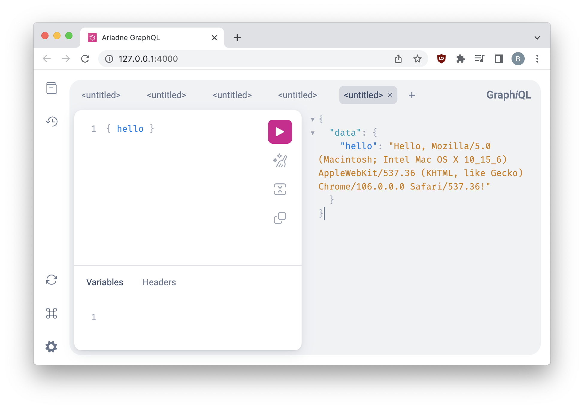

Welcome to Ariadne!

This guide will introduce you to the basic concepts behind creating GraphQL APIs, and show how Ariadne helps you to implement them with just a little Python code.

At the end of this page you will have your own simple GraphQL API accessible through the browser, implementing a single field that returns a "Hello" message along with a client's user agent.

Make sure that you've installed Ariadne using `pip install ariadne`, and that you have your favorite code editor open and ready.


## Defining schema

First, we will describe what data can be obtained from our API.

In Ariadne this is achieved by defining Python strings with content written in [Schema Definition Language](https://graphql.org/learn/schema/) (SDL), a special language for declaring GraphQL schemas.

We will start by defining the special type `Query` that GraphQL services use as an entry point for all reading operations. Next, we will specify a single field, named `hello`, and define that it will return a value of type `String`, and that it will never return `null`.

Using the SDL, our `Query` type definition will look like this:

```graphql
type_defs = """
    type Query {
        hello: String!
    }
"""
```

The `type Query { }` block declares the type, `hello` is the field definition, `String` is the return value type, and the exclamation mark following it means that the returned value will never be `null`.


## Validating schema

Ariadne provides the `gql` utility function to validate schema. It takes a single argument (a GraphQL string) like the following example:

```python
from ariadne import gql

type_defs = gql("""
    type Query {
        hello String!
    }
""")
```

`gql` validates the schema and raises a descriptive `GraphQLSyntaxError`, if there is an issue, or returns the original unmodified string if it is correct.

If we try to run the above code now, we will get an error pointing to incorrect syntax within our `type_defs` declaration:

```
graphql.error.syntax_error.GraphQLSyntaxError: Syntax Error: Expected :, found Name

GraphQL request (3:19)
    type Query {
        hello String!
              ^
    }
```

Using `gql` is optional; however, without it, the above error would occur during your server's initialization and point to somewhere inside Ariadne's GraphQL initialization logic, making tracking down the error tricky if your API is large and spread across many modules.


## First resolver

The resolvers are functions mediating between API consumers and the application's business logic. In Ariadne every GraphQL type has fields, and every field has a resolver function that takes care of returning the value that the client has requested.

We want our API to greet clients with a "Hello (user agent)!" string. This means that the `hello` field has to have a resolver that somehow finds the client's user agent, and returns a greeting message from it.

At its simplest, a resolver is a function that returns a value:

```python
def resolve_hello(*_):
    return "Hello..."  # What's next?
```

The above code is perfectly valid, with a minimal resolver meeting the requirements of our schema. It takes any arguments, does nothing with them and returns a blank greeting string.

Real-world resolvers are rarely that simple: they usually read data from some source such as a database, process inputs, or resolve value in the context of a parent object. How should our basic resolver look to resolve a client's user agent?

In Ariadne every field resolver is called with at least two arguments: the query's parent object, and the query's execution `info` that usually contains a `context` attribute. The `context` is GraphQL's way of passing additional information from the application to its query resolvers.

> In the above example, note the `*_` argument in the resolver's method signature. The underscore is a convention used in many languages (including Python) to indicate a variable that will not be used. The asterisk prefix is Python syntax that informs the method it should expect a variable-length argument list. In effect, the above example is throwing away any arguments passed to the resolver.  We've used that here, to simplify the example so that you can focus on its purpose.

The default GraphQL server implementation provided by Ariadne defines
`info.context` as a Python `dict` containing a single key named `request`
containing a request object. We can use this in our resolver:

```python
def resolve_hello(_, info):
    request = info.context["request"]
    user_agent = request.headers.get("user-agent", "guest")
    return "Hello, %s!" % user_agent
```

Notice that we are discarding the first argument in our resolver. This is because `resolve_hello` is a special type of resolver: it belongs to a field defined on a root type (`Query`), and such fields, by default, have no parent that could be passed to their resolvers. This type of resolver is called a *root resolver*.

Now we need to set our resolver on the `hello` field of type `Query`. To do this, we will use the `QueryType` class that sets resolver functions to the `Query` type in the schema. First, we will update our imports:

```python
from ariadne import QueryType, gql
```

Next, we will instantiate the `QueryType` and set our function as resolver for `hello` field using its field decorator:

```python
# Create QueryType instance for Query type defined in our schema...
query = QueryType()


# ...and assign our resolver function to its "hello" field.
@query.field("hello")
def resolve_hello(_, info):
    request = info.context["request"]
    user_agent = request.headers.get("user-agent", "guest")
    return "Hello, %s!" % user_agent
```

## Making executable schema

Before we can run our server, we need to combine our textual representation of the API's shape with the resolvers we've defined above into what is called an "executable schema". Ariadne provides a function that does this for you:

```python
from ariadne import make_executable_schema
```

You pass it your type definitions and resolvers that you want to use:

```python
schema = make_executable_schema(type_defs, query)
```

In Ariadne the process of adding the Python logic to GraphQL schema is called *binding to schema*, and special types that can be passed to `make_executable_schema`'s second argument are called *bindables*. `QueryType` (introduced earlier) is one of many *bindables* provided by Ariadne that developers will use when creating their GraphQL APIs.

In our first API we passed only a single bindable to the `make_executable_schema`, but most of your future APIs will likely pass a list of bindables instead, for example:

```python
make_executable_schema(type_defs, [query, user, mutations, fallback_resolvers])
```

> It's possible to call `make_executable_schema` without bindables, but doing so will result in your API handling very limited number of use cases: browsing schema types and, if you've defined root resolver, accessing root type's fields.


## Testing the API

Now we have everything we need to finish our API, with the only missing piece being the HTTP server that would receive the HTTP requests, execute GraphQL queries and return responses.

Use an ASGI server like [uvicorn](http://www.uvicorn.org/), [daphne](https://github.com/django/daphne/), or [hypercorn](https://pgjones.gitlab.io/hypercorn/) to serve your application:

```console
$ pip install uvicorn
```

Create a `ariadne.asgi.GraphQL` instance for your schema:

```python
from ariadne.asgi import GraphQL

app = GraphQL(schema, debug=True)
```

Run your script with `uvicorn myscript:app` (remember to replace `myscript.py` with the name of your file!). If all is well, you will see a message telling you that the simple GraphQL server is running at http://127.0.0.1:8000. Open this link in your web browser.

You will see the GraphiQL, the open source API explorer for GraphQL APIs. You can enter a `{ hello }` query on the left, press the big purple "run" button, and see the result on the right:



Your first GraphQL API build with Ariadne is now complete. Congratulations!


## Completed code

For reference here is complete code of the API from this guide:

```python
from ariadne import QueryType, gql, make_executable_schema
from ariadne.asgi import GraphQL

type_defs = gql("""
    type Query {
        hello: String!
    }
""")

# Create type instance for Query type defined in our schema...
query = QueryType()

# ...and assign our resolver function to its "hello" field.
@query.field("hello")
def resolve_hello(_, info):
    request = info.context["request"]
    user_agent = request.headers.get("user-agent", "guest")
    return "Hello, %s!" % user_agent

schema = make_executable_schema(type_defs, query)
app = GraphQL(schema, debug=True)
```
