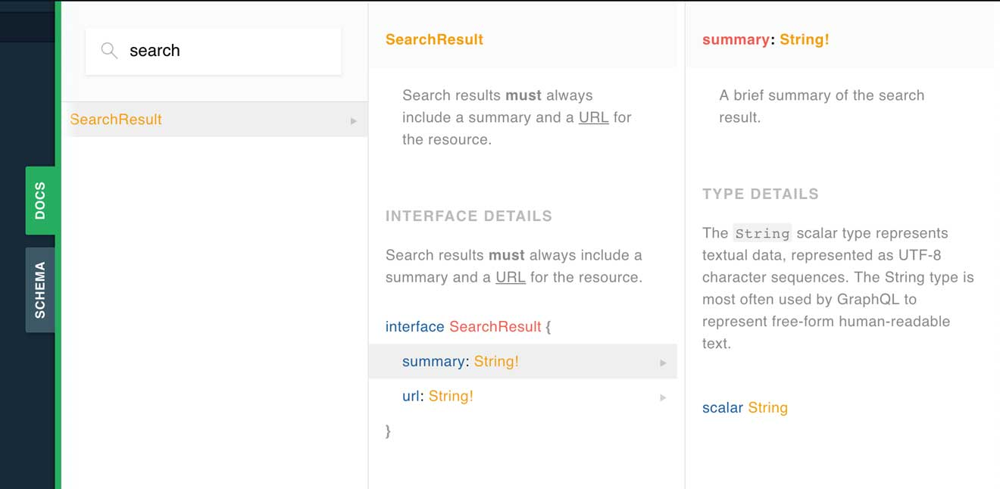

.. _documenting-schema:

Documenting a GraphQL schema
============================

The GraphQL specification includes two features that make documentation and schema exploration easy and powerful.  Those features are descriptions and introspection queries.

There is now a rich ecosystem of tools built on top of those features.  Some of which include IDE plugins, code generators and interactive API explorers.

Interactive API explorers
-------------------------

Ariadne's built-in servers ship with `GraphQL Playground <https://github.com/prisma/graphql-playground>`_, a popular interative API explorer.

GraphQL Playground allows developers and clients to explore the relationships between types across your schema in addition to reading detail about individual types.

Descriptions
------------

GraphQL schema definition language supports a special `description syntax <https://facebook.github.io/graphql/June2018/#sec-Descriptions>`_.  This allows you to provide additional context and information alongside your type definitions, which will be accessible both to developers and API consumers.

GraphQL descriptions are declared using a format that feels very similar to Python's `docstrings`::

    query = '''
        """
        Search results must always include a summary and a URL for the resource.
        """
        interface SearchResult {
            "A brief summary of the search result."
            summary: String!

            "The URL for the resource the search result is describing."
            url: String!
        }
    '''

Note that GraphQL descriptions also support Markdown (as specified in `CommonMark <https://commonmark.org/>`_)::

    query = '''
        """
        Search results **must** always include a summary and a
        [URL](https://en.wikipedia.org/wiki/URL) for the resource.
        """
        interface SearchResult {
            # ...
        }
    '''

Introspection Queries
---------------------

The GraphQL specification also defines a programmatic way to learn about a server's schema and documentation.  This is called `introspection <https://graphql.org/learn/introspection/>`_.

The Query type in a GraphQL schema also includes special introspection fields (prefixed with a double underscore) which allow a user or application to ask for information about the schema itself::

    query IntrospectionQuery {
        __schema {
            types {
                kind
                name
                description
            }
        }
    }

A response to the above query might look like this:

.. code-block:: json

    {
        "__schema": {
            "types": [
                {
                    "kind": "OBJECT",
                    "name": "Query",
                    "description": "A simple GraphQL schema which is well described.",
                }
            ]
        }
    }

.. note::
    Tools like GraphQL Playground use introspection queries internally to provide the live, dynamic experiences they do.
