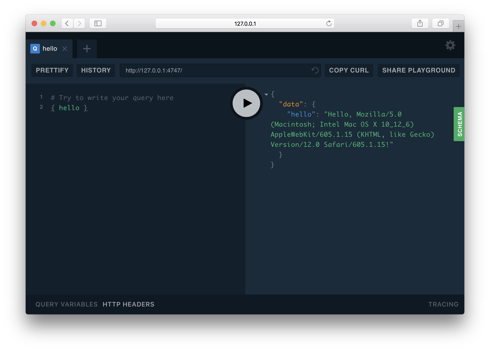

Introduction
============

Welcome to Ariadne!

This guide will introduce you to the basic concepts behind creating GraphQL APIs, and show how Ariadne helps you to implement them with just a little Python code.

At the end of this guide you will have your own simple GraphQL API accessible through the browser, implementing a single field that returns a "Hello" message along with a client's user agent.

Make sure that you've installed Ariadne using ``pip install ariadne``, and that you have your favorite code editor open and ready.

Defining schema
---------------

First, we will with describe what data can be obtained from our API.

In Ariadne this is achieved by defining Python strings with content written in `Schema Definition Language <https://graphql.github.io/learn/schema/>`_ (SDL), a special language for declaring GraphQL schemas.

We will start with defining the special type ``Query`` that GraphQL services use as entry point for all reading operations. Next we will specify a single field on it, named ``hello``, and define that it will return a value of type ``String``, and that it will never return ``null``.

Using the SDL, our ``Query`` type definition will look like this::

    type_defs = """
        type Query {
            hello: String!
        }
    """

The ``type Query { }`` block declares the type, ``hello`` is the field definition, ``String`` is the return value type, and the exclamation mark following it means that returned value will never be ``null``.

Resolvers
---------

The resolvers are functions mediating between API consumers and the application's business logic. Every type has fields, and every field has a resolver function that takes care of returning the value that the client has requested.

We want our API to greet clients with a "Hello (user agent)!" string. This means that the ``hello`` field has to have a resolver that somehow finds the client's user agent, and returns a greeting message from it.

We know that a resolver is a function that returns value, so let's begin with that::

    def resolve_hello(*_):
        return "Hello..."  # What's next?

The above code is perfectly valid, minimal resolver meeting the requirements of our schema. It takes any arguments, does nothing with them and returns blank greeting string.

Real-world resolvers are rarely that simple: they usually read data from some source such as a database, process inputs, or resolve value in the context of a parent object. How should our basic resolver look to resolve a client's user agent?

In Ariadne every field resolver is called with at least two arguments: ``obj`` parent object, and the query's execution ``info`` that usually contains the ``context`` attribute that is GraphQL's way of passing additional information from the application to its query resolvers.

Default GraphQL server implementation provided by Ariadne defines ``info.context`` as Python ``dict`` containing a single key named ``environ`` containing basic request data. We can use this in our resolver::

    def resolve_hello(_, info):
        request = info.context["environ"]
        user_agent = request.get("HTTP_USER_AGENT", "guest")
        return "Hello, %s!" % user_agent

Notice that we are discarding the first argument in our resolver. This is because ``resolve_hello`` is special type of resolver: it belongs to a field defined on a root type (`Query`), and such fields, by default, have no parent that could be passed to their resolvers. This type of resolver is called a *root resolver*.

Now we need to map our resolver to the  ``hello`` field of type ``Query``. To do this, we will create special dictionary where every key is named after a type in the schema. This key's value will, in turn, be another dictionary with keys named after type fields, and with resolvers as values::

    resolvers = {
        "Query": {
            "hello": resolve_hello
        }
    }

A dictionary mapping resolvers to schema is called a *resolvers map*.

Testing the API
---------------

Now we have everything we need to finish our API, with only piece missing being the http server that would receive the HTTP requests, execute GraphQL queries and return responses.

This is where Ariadne comes into play. One of the utilities that Ariadne provides to developers is a WSGI middleware that can also be run as simple http server for developers to experiment with GraphQL locally.

.. warning::
   Please never run ``GraphQLMiddleware`` in production without a proper WSGI container such as uWSGI or Gunicorn.

This middleware can be imported directly from ``ariadne`` package, so lets add an appropriate import at the beginning of our Python script::

    from ariadne import GraphQLMiddleware

We will now call ``GraphQLMiddleware.make_simple_server`` class method with ``type_defs`` and ``resolvers`` as its arguments to construct a simple dev server that we can then start::

    print("Visit the http://127.0.0.1:8888 in the browser and say { hello }!")
    my_api_server = GraphQLMiddleware.make_simple_server(type_defs, resolvers)
    my_api_server.serve_forever()

Run your script with ``python myscript.py`` (remember to replace ``myscript.py`` with name of your file!). If all is well, you will see a message telling you to visit the http://127.0.0.1:8888 and say ``{ hello }``.

This the GraphQL Playground, the open source API explorer for GraphQL APIs. You can enter ``{ hello }`` query on the left, press the big bright "run" button, and see the result on the right:

Your first GraphQL API build with Ariadne is now complete. Congratulations!

Completed code
--------------

For reference here is complete code of the API from this guide::

    from ariadne import GraphQLMiddleware

    type_defs = """
        type Query {
            hello: String!
        }
    """

    def resolve_hello(_, info):
        request = info.context["environ"]
        user_agent = request.get("HTTP_USER_AGENT", "guest")
        return "Hello, %s!" % user_agent

    resolvers = {
        "Query": {
            "hello": resolve_hello
        }
    }

    print("Visit the http://127.0.0.1:8888 in the browser and say { hello }!")
    my_api_server = GraphQLMiddleware.make_simple_server(type_defs, resolvers)
    my_api_server.serve_forever()
